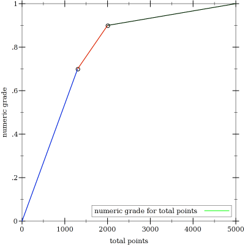

sf-check
========

sf-check is a semi-automated grading system for select chapters of Software Foundations. Its semi-
automated (as opposed to fully-automated) nature comes from the two classes of exercises found in
Software Foundations.

The first class consists solely of SF-provided boilerplate definitions/theorems/etc. that must be 
filled in by the student. These exercises are graded automatically by running `coqc`. An exercise 
receives credit only if all exercise parts are soundly accepted by Coq.

The second class has some component which must be graded manually. This may involve writing a 
definition or proving a proposition from scratch, or composing an informal proof or something 
otherwise foreign to Coq. In any case, certain parts must be defined in Coq to flag the exercise 
for manual grading. This is explained in more depth later.

The grading system assumes the existence of a directory hierarchy

    students/<student-name>/<turnin>/<chapter>.v

where *student-name* is arbitrary, *turnin* is one of `0.0`, `0.5`, `1.0`, ..., `14.5`, and *chapter* 
exactly matches one of the 17 chapters in the course.

Grades are calculated by running

    racket coq.rkt [<depth>]

where *depth* can be 0-3 and defaults to 0. The *depth* parameter refers to the depth of the report 
where values correspond to the following point breakdowns

    0 - semester
    1 - turnin
    2 - chapter
    3 - exercise

Because manually-graded exercises are not accounted for by the system automatically, the 
locally-reported grade will be less than the actual grade if exercises with a manual component have 
been completed. Any such exercises will be listed in grade output.

Output roughly follows the format

    <student-name>              <numeric-grade> (<letter-grade>)
    total                                      <semester-points>
      <turnin>                                   <turnin-points>
        <chapter>                               <chapter-points>
        ...
      ...
      <flagged-exercise>
      ...

where *numeric-grade* * 100 gives the percentage from which *letter-grade* is determined, and 
*X-points* is the point contribution of the corresponding *X*.

##Scoring

There are approximately 5000 points available among all the exercises. For total points earned, 
the numeric grade function is this graph:

There are two components which determine the points earned for a completed exercise: difficulty and 
lateness.

###Difficulty

Most exercises in SF are accompanied by a difficulty rating expressed in stars. This difficulty 
corresponds to an expected amount of time an exercise of that difficulty should take to complete, 
which is given in the SF introductory chapter. This correspondence, as given, is

  stars  duration
  1      1-2 minutes
  2      5-10 minutes
  3      15-30 minutes
  4      60-120 minutes

However, some exercises are designated 5-star difficulty and some are not designated at all. We assume 
the correspondence

  stars  duration
  5      240-480 minutes
  *      5-10 minutes

which may be adjusted to better reflect reality.

The point worth of an exercise is the lower bound of the given range.

There are just under 2000 points worth of 1-, 2-, and 3-star exercises. Completing only these in a 
timely way will earn you a solid B.

###Lateness

Submissions are penalized 1/20 of the remaining possible points for every turn-in period late. 
Thus, a 3-star exercise (with a point worth of 15) due week 4.5 but turned in week 5.5 is one 
week (two turn-in periods) late and will receive 15 * 0.95^2 (about 13.5) points.

Inversely, submissions are rewarded 1/19 of the accumulated possible points for every 
turn-in period early. Here, a 3-star exercise due week 4.5 but turned in week 3.5 is one week 
early and will receive 15 * 0.95^-2 (about 16.6) points.

If an exercise appears in multiple turnins, only the earliest contributes points. This permits the 
natural workflow of keeping a working directory of chapters and copying a chapter-in-progress to 
the present turnin when submitting, ensuring that the local hierarchy mirrors the instructor's as 
much as possible.

## Curriculum

The `curriculum.sexp` file contains exercise information for each chapter. Exercise entries match the 
following pattern:

    (<name> <difficulty> <designation> <manual?> (<part-name> ...))

*name* is the name of the exercise given by the text, the name of the first part if no proper name is 
given, or `#f` if the exercise has no parts.

*difficulty* is the number of stars given by the text, or `#f` if none is given.

*designation* is the `optional`, `recommended`, or `extended` designation given by the text, or `#f` if 
absent. This field is ignored by this grading system.

*manual?* specifies whether this exercise has a component that requires manual grading. An exercise with 
such a component will not be flagged for grading unless every part of the exercise is soundly defined. 
For exercises with no Coq component, a dummy definition or proposition named after the exercise itself 
should be proven, perhaps like:

    Fact <name>: true = true.
    Proof. reflexivity. Qed.

`(*part-name* ...)` is a list of the parts that comprise the exercise. For <manual?> exercises, this is 
often a singleton list which item has the same name as the exercise itself. In such cases, a proposition 
with this name is seldom found in the text, but should be added, as in the *manual?* description.
